**support bot v2.0 с Инлаин кнопками**

**Author:** @ArchieWh1te

**Language:** Python 3.8

**framework for Telegram** Aiogram 2.23.1 

**License:** Free

[](https://pypi.org/project/aiogram/)


### Бот Технической поддержки 


**Описание:**

Бот технической поддержки — это упорядоченная и технологичная организация деятельности предприятия для ведения переговоров между пользователем и сотрудниками технической поддержки. 
Написаный на фреймворке AioGram на языке Python. 

**Действующие лица:**

+ Ваши Пользователи (клиенты),

+ Закрытый Чат Поддержки (где сидят те, кто будет отвечать на вопросы Пользователей),

+ Бот (которому Пользователи будут писать свои вопросы).

**Вот так это все будет работать:**

1. Вы публикуете ссылку на Бота.
2. Пользователи регистрируются в нём указывая данные которые попросит бот.
3. После регистрации Пользователи пишут в него свои вопросы через кнопку `Задать вопрос`.
4. Бот пересылает их сообщения в ваш Чат Поддержки.
5. В этом чате вы или ваши помощники отвечают на сообщение (через  инлаин кнопку `Ответить`).
6. Бот пересылает ответ обратно пользователю от своего лица, скрывая аккаунт отвечающего.

**Регистрация пользователей:**

1. Регистрация пользователей проходит через бота по кнопке Регистрация.
2. Бот попросил ввести данные Фамилию, Имя, номер телефона и организацию(магазин).
3. После регистрации данные запишутся в БД таблицы PostgreSQL.
4. Пользователь(клиенты) смогут задать вопрос по кнопке `Задать вопрос`.

**Регистрация администраторов (сотрудники Технической поддержки):**

1. Регистрация сотрудников ТП в БД происходит по команде `/newadmin`.
2. После этого надо установить через **PgAdmin** в таблице `admins` в столбце `flag` вместо `noadmin` значение `admin` (делается один раз для главного админа)

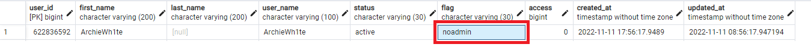
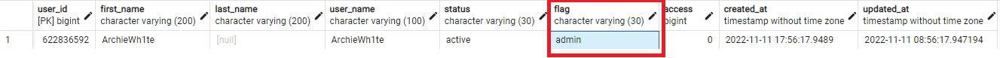
3. Чтобы дать права остальным сотрудникам нужно использовать команду `/флаг ID_пользователя`

**Запуск бота**

Все зависимости хранятся в файле `requirements.txt`

Для запуска бота используйте файл *```app.py```*

**Команды админа:**

```
/ответ id ТЕКСТ  - ответить пользователю от имени бота

/бан id причина  - забанить пользователя у бота

/разбан id  - снять бан пользователя

/нотис  - отправить уведомление всем сотрудникам ТП

/профиль ID-Пользователя  - Посмотреть профиль пользователя

/флаг ID-Администратора  - Дать права Администратора

/унфлаг ID-Администратора  - Снять права Администратора

/магазин ID-Пользователя НазваниеОрганизации  - Сменить организацию у пользователя

/удалить ID-Пользователя  - Удалить пользователя из БД

/фамилия ID-Пользователя Фамилия_Пользователя - Сменить Фамилию у пользователя

/имя ID-Пользователя Фамилия_Пользователя - Сменить Имя у пользователя

/номер ID-Пользователя Номер_Пользователя - Сменить номер у пользователя
```
**Для работы вам потребуется:**

1)установить все зависимости из *requirements.txt*

2)Установить **PostgreSQL** и настроить его 

3)Отредактировать файл **.env** там указываете конфигурацию для подключения к **PostgreSQL** и токкен для бота.
```
BOT_TOKEN=тутваштоккен

ip=localhost

PGUSER=пользовательПостгресса

PASSWORD=парольотпользователяБД

DATABASE=имяБД
```
4)Изменить настройки в файле **config** на свои параметры в переменной *admins*

``admins = [
   тут айдишники администраторов]
``
## Видео
**Регистрация пользователя**

[](https://youtu.be/YkVXT6cjICw)

**Подача заявки в группу ТП и ответ на неё**

[](https://youtu.be/3iXDVqx3fSg)


## Скриншоты

**Админский блок**

*Регистрация администратора*

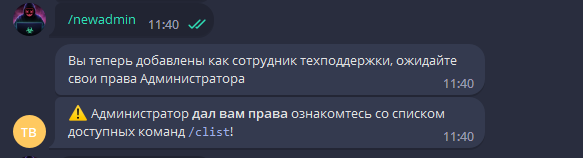

*После регистрации как администратор*

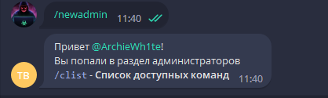

*Команды админа*

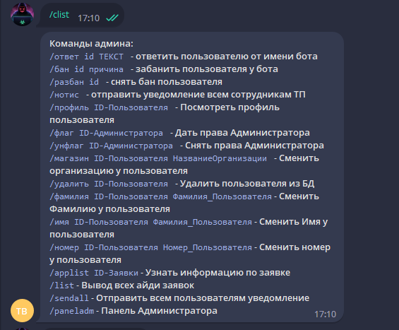

*Команды админа из панели*

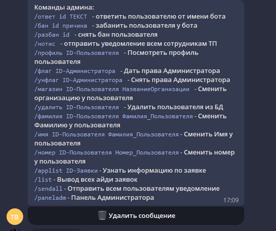

*Панель управления Администратора*

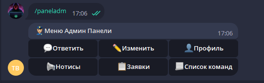

*Дать права администратора*

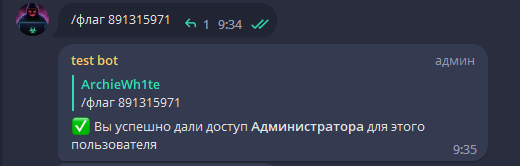

*Ответ через кнопку Ответить*

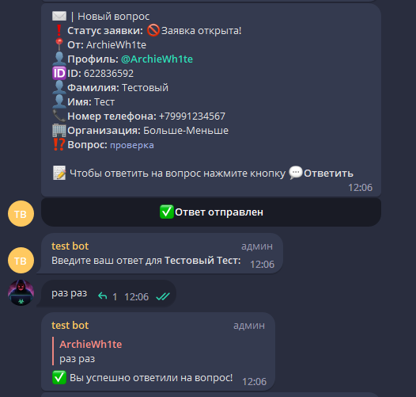

*Уведомление о запуске бота*

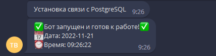

**Пользовательский блок**

*Команда /start*

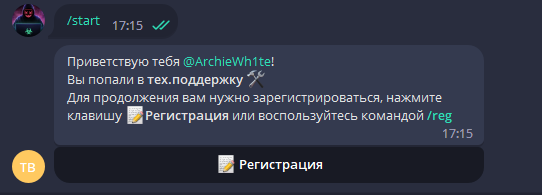

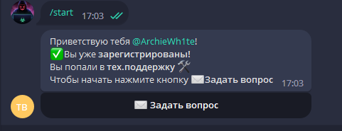

*Регистрация Фамилия:*

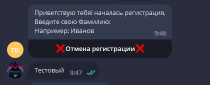

*Регистрация Имя:*

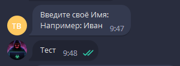

*Регистрация Номер:*

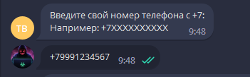

*Регистрация Организация(Магазин):*

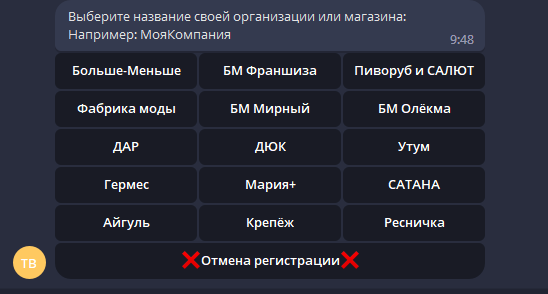

*Завершение регистрации*

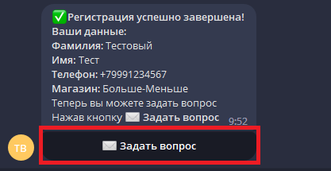

*Команда /start после регистрации*

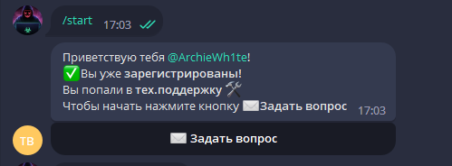

*Когда бот не видит команд*

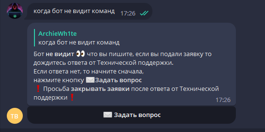

*После нажатия на кнопку Задать вопрос*

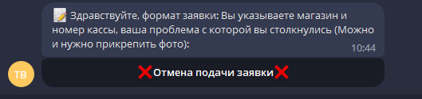

*Подача заявки*

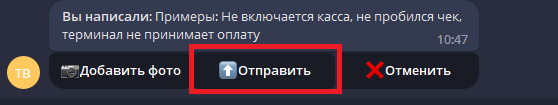


*Ответ от сотрудников ТП*

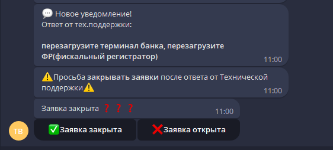

*После ответа от ТП Закрытие заявки*

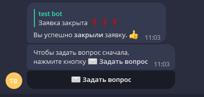

*Если заявку не закрыли то продолжаем диалог*

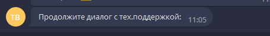